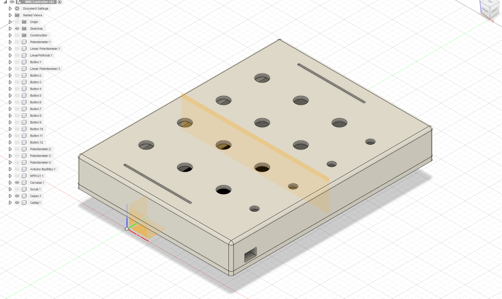

# DYI-Launchpad
Acest proiect consta in realizarea unui Launchpad DIY care se poate conecta direct prin USB la un software DAW fara a fi nevoie de un alt software intermediar.
## Componente folosite:
* Adafruit Itsy Bitsy 32u4
* Adafruit MPR121 ( modul cu 12 intrari capacitive )
* Piesa metalica x6 ( ce se comporta ca un buton capacitiv )
* Potentiometru glisant x2
* Potentiometru rotativ x4
* Carcasa imprimata 3D

Pentru realizarea interfatei MIDI s-a folosit libraria "MIDIUSB.h" valabila pentru Arduino ce transmite direct prin USB catre DAW informatii primite de la cele 
12 piese metalice conectate la MPR121, si de la cele 6 potentiometre.

Carcasa a fost proiectata in programul Fusion 360:

